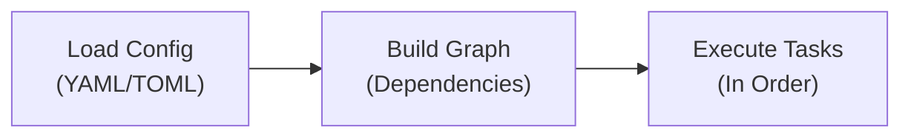
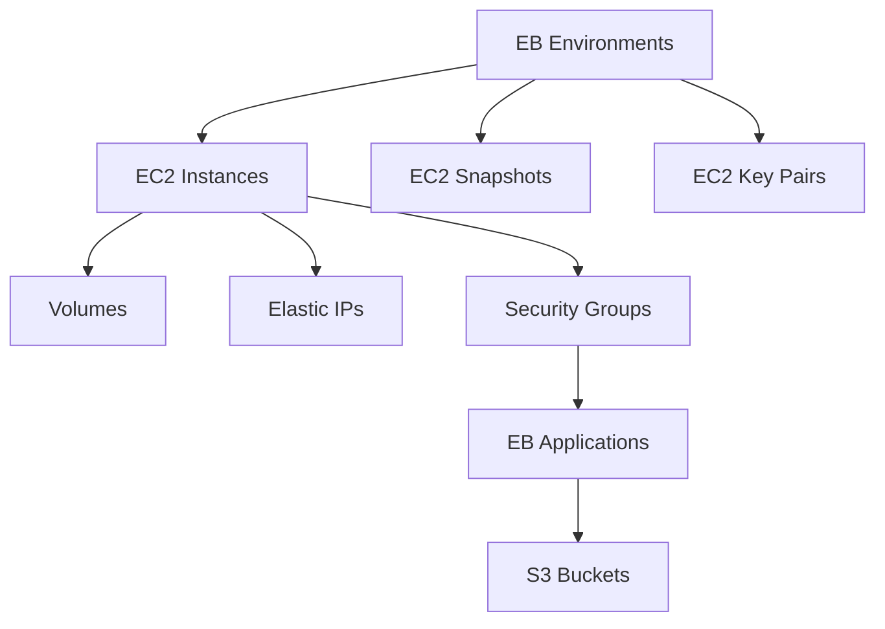
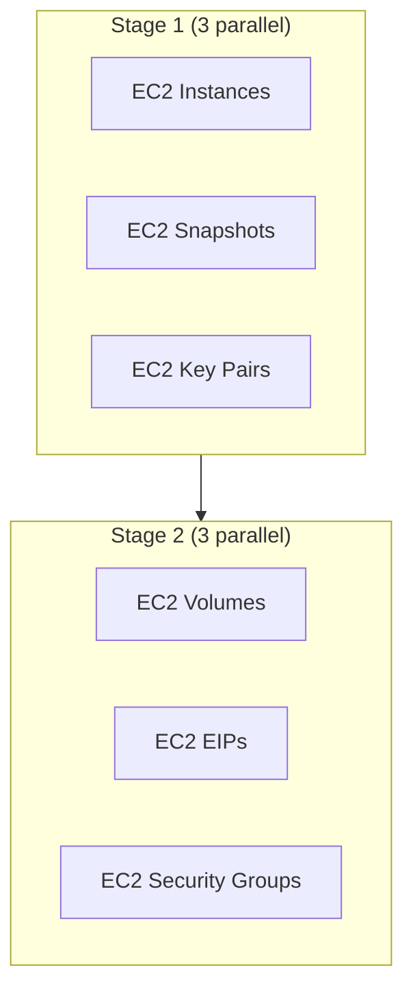

# How CostCutter Works

CostCutter uses a dependency-aware execution model to safely delete AWS resources in the correct order.

## Overview



## Execution Flow

### 1. Configuration Loading

CostCutter loads settings from multiple sources in precedence order:

1. CLI arguments (highest priority)
2. Environment variables (`COSTCUTTER_*`)
3. Project config file (`costcutter.yaml`)
4. Global config file (`~/.config/costcutter/config.toml`)
5. Built-in defaults (lowest priority)

### 2. AWS Session Initialization

A `boto3` session is created using:

- Configured AWS profile, or
- Explicit access keys, or
- Default credential chain

### 3. Resource Discovery

For each enabled service and region:

1. Call AWS `Describe*` APIs to list resources
2. Build a list of resources to delete
3. Record discovered resources in the reporter

### 4. Dependency Graph Construction

CostCutter builds a directed acyclic graph (DAG) where:

- **Nodes** = Resources to delete (e.g., `ec2/instances/us-east-1`)
- **Edges** = Dependencies (e.g., instances must be deleted before volumes)

### 5. Topological Sort

The graph is sorted to determine execution order:



### 6. Staged Execution

Tasks are grouped into stages. Within each stage:

- Tasks run in parallel (controlled by `max_workers`)
- Each task calls the resource handler
- Individual resource deletions run in parallel (controlled by `resource_max_workers`)

## Dry-Run Mode

When `dry_run: true` (the default):

| Action | Dry-Run | Live |
|--------|---------|------|
| Resource discovery | ✅ Yes | ✅ Yes |
| Dependency graph | ✅ Built | ✅ Built |
| AWS `Describe` calls | ✅ Yes | ✅ Yes |
| AWS `Delete` calls | ❌ No | ✅ Yes |
| Reporting | ✅ "Would delete" | ✅ "Deleted" |

AWS APIs often support a `DryRun` parameter. CostCutter uses this to validate that deletion *would* succeed without executing.

## Error Handling

### Retries

CostCutter handles transient failures:

- Failed tasks are collected during each stage
- After all stages complete, failed tasks are retried once
- Exponential backoff is used for AWS rate limits

### Rate Limiting

AWS API rate limits are handled with:

- Configurable parallelism (`max_workers`, `resource_max_workers`)
- Automatic retry with backoff
- Pagination for large resource lists

### Failure Modes

| Failure Type | Behavior |
|--------------|----------|
| API rate limit | Retry with backoff |
| Permission denied | Log error, continue with other resources |
| Resource not found | Skip (may have been deleted by cascade) |
| Dependency conflict | Retry in deferred stage |

## Parallelism

Two levels of parallelism:

### Stage-Level (`max_workers`)

Controls how many resource types process simultaneously:



### Resource-Level (`resource_max_workers`)

Controls how many individual resources delete simultaneously:

```
EC2 Instances handler:
  [instance-1, instance-2, instance-3, ...]  ← 10 parallel (default)
```

## Reporting

CostCutter tracks all events:

- **Console**: Live table showing recent events
- **Summary**: Aggregated counts at the end
- **CSV**: Optional export to file for auditing

Each event records:

- Timestamp
- Region
- Service and resource type
- Action (catalog, delete)
- Resource ARN
- Status and metadata
