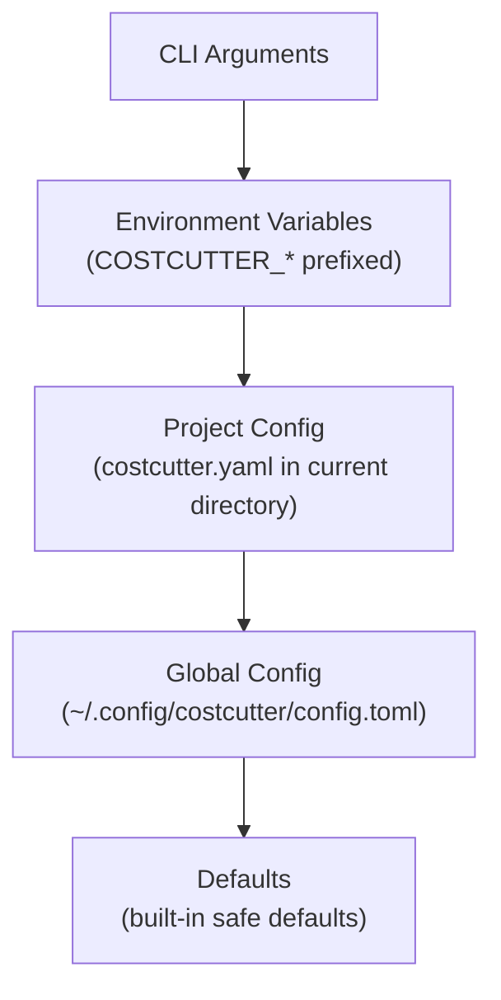

# Configuration

CostCutter's behavior is fully customizable through configuration files, environment variables, and CLI arguments.

## How Configuration Works

Configuration is loaded from multiple sources in a strict precedence order. **Higher precedence sources override lower ones.**



## Configuration File Locations

CostCutter searches for configuration files in the following locations:

| Location | Path | Description |
|----------|------|-------------|
| Project | `./costcutter.yaml` or `./costcutter.toml` | Per-project settings |
| Global | `~/.config/costcutter/config.toml` | User-wide defaults |

You can also specify an explicit config file:

```bash
costcutter --config /path/to/my-config.yaml
```

## Supported Formats

CostCutter supports three configuration file formats:

- **YAML** - `.yaml` or `.yml`
- **TOML** - `.toml`
- **JSON** - `.json`

All formats support the same configuration options. See [File Formats](file-formats.md) for complete examples.

## Quick Example

A minimal configuration file:

```yaml
# costcutter.yaml
dry_run: true

aws:
  profile: dev
  region:
    - us-east-1
  services:
    - ec2
    - s3
```

## What Can Be Configured?

| Section | Purpose |
|---------|---------|
| `dry_run` | Enable/disable simulation mode |
| `aws` | AWS credentials, regions, services, parallelism |
| `logging` | File-based logging settings |
| `reporting` | CSV export settings |

See the [Configuration Reference](reference.md) for all available options.

## Environment Variables

Every configuration option can be overridden via environment variables:

- Prefix: `COSTCUTTER_`
- Nested values: Use double underscores (`__`)

**Examples:**

```bash
# Top-level setting
export COSTCUTTER_DRY_RUN=false

# Nested setting
export COSTCUTTER_AWS__PROFILE=staging
export COSTCUTTER_AWS__REGION='["us-east-1", "eu-west-1"]'
export COSTCUTTER_LOGGING__LEVEL=DEBUG
```

-> **Next**: [File Formats](file-formats.md) | [Reference](reference.md)
