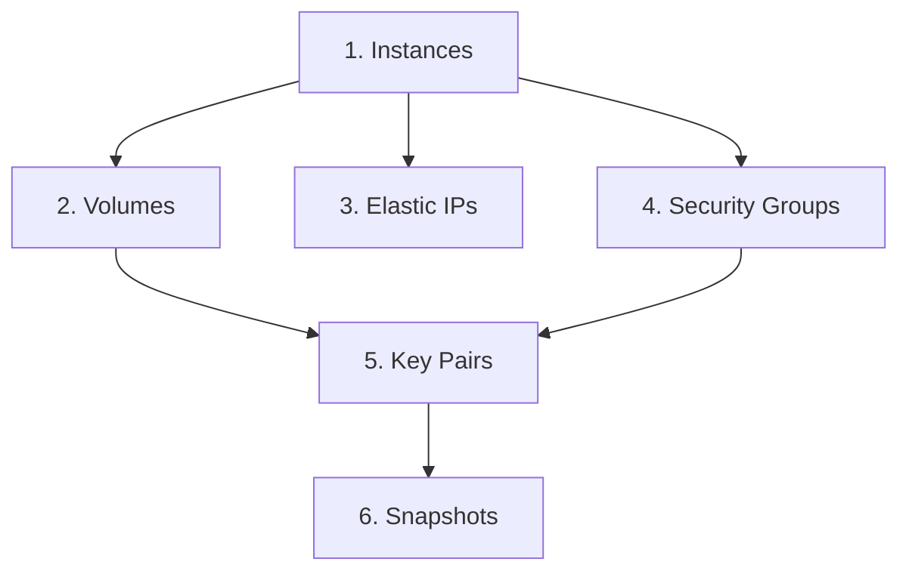

# EC2 (Elastic Compute Cloud)

CostCutter manages deletion of EC2 resources including compute instances and their associated storage and networking components.

## Supported Resources

| Resource | Config Key | What Gets Deleted |
|----------|------------|-------------------|
| Instances | `instances` | All EC2 instances (running, stopped, etc.) |
| Volumes | `volumes` | All EBS volumes (attached and unattached) |
| Snapshots | `snapshots` | All EBS snapshots owned by the account |
| Elastic IPs | `elastic_ips` | All allocated Elastic IP addresses |
| Key Pairs | `key_pairs` | All EC2 key pairs |
| Security Groups | `security_groups` | All custom security groups (default SGs are skipped) |

## Risk Levels

| Resource | Risk | Impact |
|----------|------|--------|
| Instances | 🔴 High | Running workloads terminated, data on instance storage lost |
| Volumes | 🔴 High | All data on EBS volumes permanently deleted |
| Snapshots | 🟡 Medium | Backup snapshots deleted (source volumes unaffected) |
| Elastic IPs | 🟢 Low | IP addresses released back to AWS pool |
| Security Groups | 🟢 Low | Firewall rules removed |
| Key Pairs | 🟡 Medium | SSH access keys deleted from AWS (local `.pem` files unaffected) |

## Deletion Order Within EC2

EC2 resources are deleted in dependency order:



**Note:** Instances must terminate first to release volumes, IPs, and security groups. Key Pairs and Snapshots are independent.

## What Happens

### Instances

- **Action**: `terminate_instances` with `Force=True`, `SkipOsShutdown=True`
- **Behavior**: Immediately terminates instances without graceful shutdown
- **Instance storage**: Data on instance store volumes is lost
- **EBS volumes**: Root volumes are deleted; additional volumes marked for deletion

### Volumes

- **Action**: `delete_volume`
- **Behavior**: Deletes the volume and all data
- **Attached volumes**: Only deleted after instance termination (automatic detach)

### Snapshots

- **Action**: `delete_snapshot`
- **Behavior**: Removes the snapshot from AWS
- **Source volumes**: Unaffected-snapshots are independent copies

### Elastic IPs

- **Action**: `release_address`
- **Behavior**: Returns the IP address to the AWS pool
- **Associated IPs**: Automatically disassociated when instances terminate

### Key Pairs

- **Action**: `delete_key_pair`
- **Behavior**: Removes the public key from AWS
- **Local files**: Your local `.pem` file is not affected
- **Access**: You cannot create new instances with this key pair

### Security Groups

- **Action**: `delete_security_group`
- **Behavior**: Removes the security group and all rules
- **Default SG**: The `default` security group cannot be deleted (AWS restriction)
- **Dependencies**: Ingress/egress rules referencing other groups are cleared first

## Limitations

CostCutter's EC2 handling does **not**:

- Preserve instances with specific tags
- Wait for graceful shutdown
- Back up volumes before deletion
- Handle Auto Scaling Groups (use Elastic Beanstalk or manual cleanup)
- Manage Launch Templates or AMIs

## Example: EC2 Only

```yaml
# costcutter.yaml
aws:
  services:
    - ec2
  region:
    - us-east-1
```

```bash
costcutter --dry-run --services ec2
```
