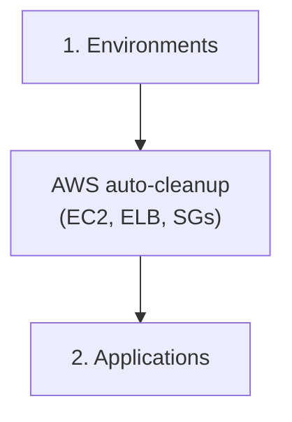

# Elastic Beanstalk

CostCutter manages deletion of Elastic Beanstalk environments and applications.

## Supported Resources

| Resource | Config Key | What Gets Deleted |
|----------|------------|-------------------|
| Environments | `environments` | All EB environments (including underlying EC2, ELB, RDS) |
| Applications | `applications` | All EB applications (after environments are deleted) |

## Risk Levels

| Resource | Risk | Impact |
|----------|------|--------|
| Environments | 🔴 High | Terminates all underlying resources (EC2, load balancers, RDS if configured) |
| Applications | 🟡 Medium | Removes application metadata and configuration |

## Cascade Behavior

!!! warning "Elastic Beanstalk Cascades to EC2"
    When an EB environment is terminated, AWS automatically deletes the underlying infrastructure:

    - EC2 instances
    - Load balancers
    - Security groups created by EB
    - RDS instances (if provisioned with the environment)

This is why CostCutter deletes Elastic Beanstalk environments **before** processing EC2 resources-to avoid conflicts with AWS's automatic cleanup.

## Deletion Order



## What Happens

### Environments

- **Action**: `terminate_environment`
- **Behavior**: Initiates environment termination
- **Underlying resources**: AWS automatically terminates EC2 instances, load balancers, and security groups created by EB
- **RDS**: If RDS was provisioned with the environment (not externally), it is deleted
- **Duration**: Termination may take several minutes as AWS cleans up resources

### Applications

- **Action**: `delete_application`
- **Behavior**: Removes the application and all stored application versions
- **Prerequisite**: All environments must be terminated first
- **Application versions**: Stored source bundles in S3 may remain (managed by S3 cleanup)

## Dependency with EC2

CostCutter's dependency graph ensures:

1. EB environments are terminated first
2. EB-created security groups are removed by AWS
3. EC2 cleanup handles any remaining instances/resources
4. CostCutter's EC2 security group cleanup skips already-deleted groups

## Limitations

CostCutter's Elastic Beanstalk handling does **not**:

- Selectively preserve specific environments
- Handle externally-linked RDS databases (use RDS service when added)
- Manage configuration templates stored in S3

## Example: Elastic Beanstalk Only

```yaml
# costcutter.yaml
aws:
  services:
    - elasticbeanstalk
  region:
    - us-east-1
```

```bash
costcutter --dry-run --services elasticbeanstalk
```

## Recommended Combination

When cleaning up an account with EB environments, include both EB and EC2:

```yaml
aws:
  services:
    - elasticbeanstalk
    - ec2
```

This ensures CostCutter handles any EC2 resources that weren't created by Elastic Beanstalk.
