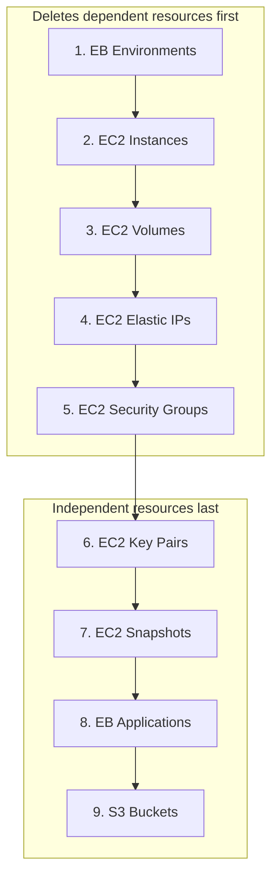

# Services

CostCutter supports multiple AWS services. Each service has specific resources that can be deleted.

## Supported Services

| Service | Key | Resources |
|---------|-----|-----------|
| [EC2](ec2.md) | `ec2` | Instances, volumes, snapshots, Elastic IPs, key pairs, security groups |
| [Elastic Beanstalk](elasticbeanstalk.md) | `elasticbeanstalk` | Environments, applications |
| [S3](s3.md) | `s3` | Buckets (including all objects and versions) |

## Enabling Services

Specify which services to clean up in your configuration:

```yaml
# costcutter.yaml
aws:
  services:
    - ec2
    - elasticbeanstalk
    - s3
```

Or via CLI:

```bash
costcutter --services ec2,s3
```

## What CostCutter Does

CostCutter **permanently deletes** AWS resources. For each service:

- Discovers all resources in the configured regions
- Builds a dependency graph to determine safe deletion order
- In dry-run mode: Reports what would be deleted
- In live mode: Executes deletions in the correct order

## What CostCutter Does NOT Do

CostCutter has intentional limitations:

| CostCutter Does | CostCutter Does Not |
|-----------------|---------------------|
| Delete entire resources | Selectively preserve tagged resources |
| Scan specified regions | Scan global resources (IAM, Route 53) |
| Handle deletion dependencies | Manage cross-account resources |
| Report on what was deleted | Create backups before deletion |

!!! warning "No Selective Deletion"
    CostCutter is a **kill-switch**, not a cleanup utility. It deletes **all** discovered resources without discrimination. There is no allowlist or tag-based filtering.

## Deletion Order

CostCutter respects AWS dependency constraints. Resources are deleted in this order:



This order ensures:

- Elastic Beanstalk environments (which create EC2 instances) are removed before EC2 cleanup
- Volumes are detached before deletion (instances terminated first)
- Security groups have no attached instances when deleted
- Applications are deleted only after all environments are gone

-> **See individual services**: [EC2](ec2.md) | [Elastic Beanstalk](elasticbeanstalk.md) | [S3](s3.md)
