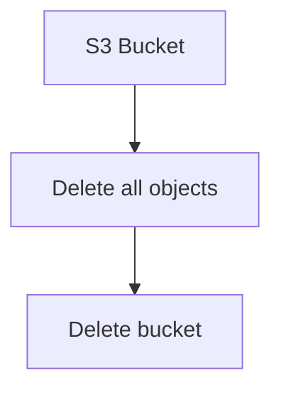

# S3 (Simple Storage Service)

CostCutter manages deletion of S3 buckets and all their contents.

## Supported Resources

| Resource | Config Key | What Gets Deleted |
|----------|------------|-------------------|
| Buckets | `buckets` | All S3 buckets, including all objects, versions, and delete markers |

## Risk Levels

| Resource | Risk | Impact |
|----------|------|--------|
| Buckets | 🔴 High | **All data permanently deleted** - objects, versions, delete markers |

!!! danger "Data Loss Warning"
    S3 bucket deletion is **irreversible**. All objects, all versions, and all delete markers are permanently deleted. There is no recovery.

## What Happens

### Bucket Deletion Process

CostCutter follows this sequence for each bucket:

1. **List all object versions** - Including current versions, non-current versions, and delete markers
2. **Delete all objects** - Batch deletion of all versions
3. **Delete the bucket** - Once empty, the bucket itself is deleted

### Versioned Buckets

For buckets with versioning enabled:

- All current object versions are deleted
- All non-current (previous) versions are deleted
- All delete markers are removed
- The bucket is then deleted

### Empty Buckets

Empty buckets are deleted directly without the object cleanup step.

## Deletion Order

S3 buckets have no dependencies on other services:



S3 buckets are independent and can be deleted at any point in the execution order.

## What Gets Deleted

| Item | Deleted? |
|------|----------|
| Current object versions | ✅ Yes |
| Non-current versions | ✅ Yes |
| Delete markers | ✅ Yes |
| Bucket policies | ✅ Yes (with bucket) |
| Bucket ACLs | ✅ Yes (with bucket) |
| Lifecycle rules | ✅ Yes (with bucket) |
| Bucket tags | ✅ Yes (with bucket) |

## Limitations

CostCutter's S3 handling does **not**:

- Preserve buckets with specific tags or names
- Handle cross-region replication (replicated objects in other buckets remain)
- Manage S3 Access Points
- Delete buckets with Object Lock enabled (AWS prevents deletion)
- Handle buckets where deletion is blocked by bucket policy

### Object Lock Buckets

If a bucket has Object Lock enabled with retained objects:

- CostCutter will attempt deletion
- AWS will reject the deletion
- The error is logged, and CostCutter continues with other buckets

## Example: S3 Only

```yaml
# costcutter.yaml
aws:
  services:
    - s3
  region:
    - us-east-1
```

```bash
costcutter --dry-run --services s3
```

## Important Considerations

### Regional Behavior

S3 buckets are global resources but tied to a region. CostCutter:

- Operates on buckets in the configured regions
- Uses the bucket's region for all API calls

### Large Buckets

For buckets with millions of objects:

- Deletion may take significant time
- CostCutter handles pagination automatically
- AWS rate limits are respected with automatic retry

### Cost Impact

Deleting a bucket eliminates:

- Storage costs for all objects
- Request costs for future operations
- Data transfer costs for replication (if configured)
